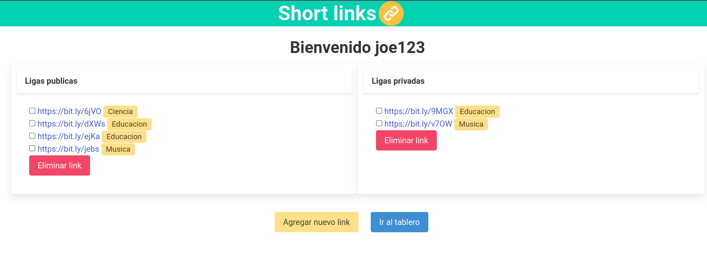

# Short links

Sistema de reducción de URLs
- Soporta el manejo de usuarios.
- Permitir que se tengan ligas publicas y ligas privadas.
- Cada usuario tiene una wishlist de los sitios que desean visitar en el futuro.
- Es posible de categorizar las URLs.

## Installation
~~~
# Opcional para crear un entorno virtual.
python3 -m venv env
source env/bin/activate

# Necesario para instalar todos los paquetes.
pip install -r requirements.txt
~~~
---

## Usage
~~~
# Opcional poner los parametros.
python app.py 127.0.0.1 6379

# Si no se ponen se usaran los valores por defecto.
python app.py
~~~

- El tercer argumento sera la direccion ip donde se esta corriendo redis, por defecto es `127.0.0.1`.

Para conocer la ip donde se esta corriendo de un contenedor de docker es con:

`docker inspect -f '{{range.NetworkSettings.Networks}}{{.IPAddress}}{{end}}' contenedor_redis`

- El cuarto argumento será el puerto donde esta escuchando redis, por defecto es `6379`.
---

## Usage with Docker in Cluster
Para arrancar la arquitectura tendremos que correr:
~~~
# Crea los contenedores de las imagenes indicadas y crea toda una red.
docker-compose up

# Eliminar todos los recursos ocupando, como los contenedores creados y la red.
docker-compose down
~~~

La primera vez que ejecute la aplicación no correra, porque es necesario especificar que crearemos un 
cluster, solo se hace una sola vez. Para ello ingresaremos a cualquier de los contenedores y le diremos:
~~~
# Ingresamos a un contenedor
docker exec -it shortlinks_redis_cluster3_1 bash

# Comando para conocer las ip de los contenedores
$ ./hosts2ip.sh

# Le indicamos que crearemos un cluster con este par de nodos.
redis-cli --cluster create 172.18.0.7:6379 172.18.0.2:6379 172.18.0.5:6379 172.18.0.4:6379 172.18.0.6:6379 172.18.0.3:6379 --cluster-replicas 1
~~~
Con esto le indicamos que cree un cluster y que haga una replica por cada nodo, es decir 3 master y 3 esclavos.

Una vez hecho el cluster, volvemos a ejecutar la aplicación y ahora funcionara correctamente.
~~~
docker-compose up
~~~

## Contributors
- Fernando Santa Rita Vizuet ([@FSRV24](https://github.com/FSRV24) )
- Fernando Avitúa ([@FunkySpiderman](https://github.com/FunkySpiderman) )
- Guillermo Andrés ([@gandres-dev](https://github.com/gandres-dev) )